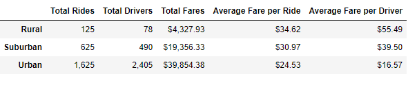

# PyBer_Analysis

## Overview of the Analysis:

To improve the ride sharing services, by providing the afffordability to the underserved areas.

## Results after analysing the PyBer Challenge data with the two deliverables:

* After After analysing the ride-sharing data of three types of city 

** Rural has the lowest number of total rides, drivers, and total fare and 
 
 highest average fares per ride and average fare per driver

** Urban has the highest number of total rides, drivers and total fares and 
 
  lowest average fares per ride and average fare per driver
 
** Suburban is in between Rural and Urban with the results of 

 the total rides, drivers, total fares, averages of fare-per ride and fare-per
  
 From the above results, it is clear that most of PyBer's revenue occurs in Urban cities.
 
 
  
 ### Summary:
 
 

The data analysis indicates that there are fewer rural users for PyBer.
The average fare per ride is highest for the rural rides.
This may be a factor for less rural users.
   * If the company can provide discount then there will be more rural users.  
 
From the analysis, the number of drivers is less in the rural area 
This might have caused longer waiting time which would have discouraged the users. 
  * By increasing number of drivers this can be improved.
  
  * The travel distance may be the factor, to determine other factors that are 
 contributing to the high ride costs in rural cities and low driver fares in urban cities.
  
  
